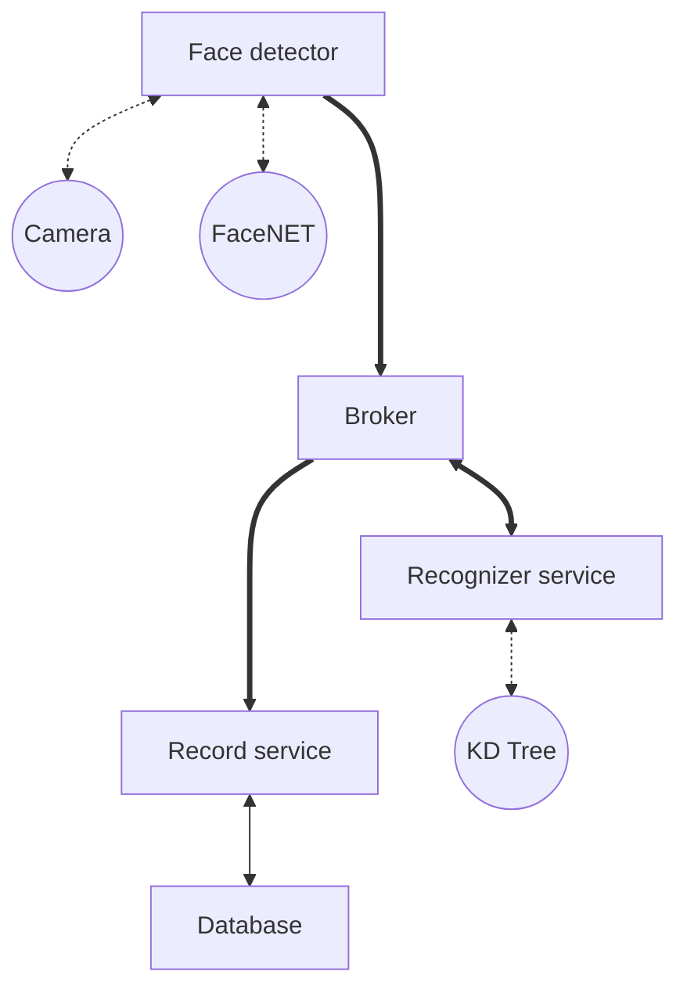
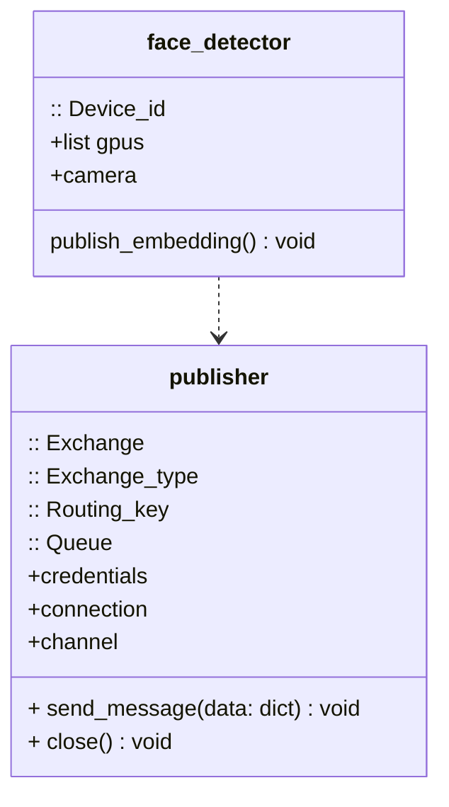
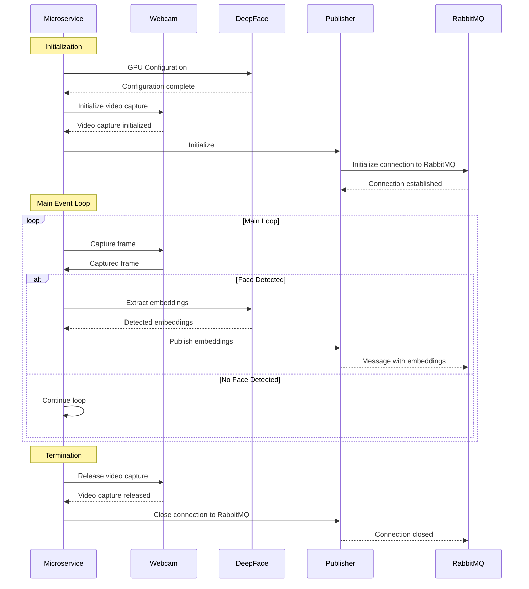
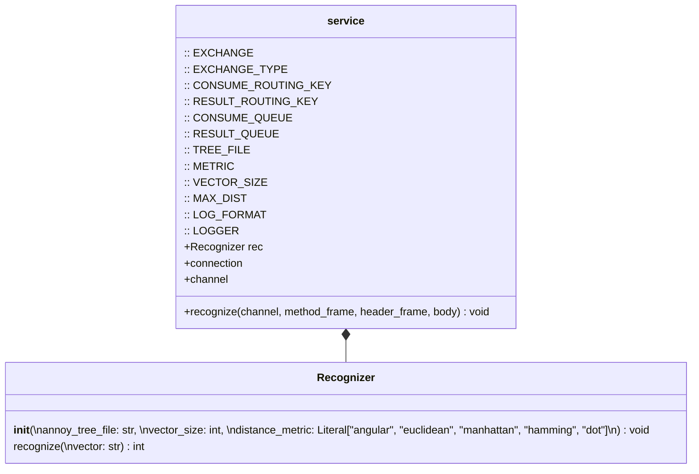
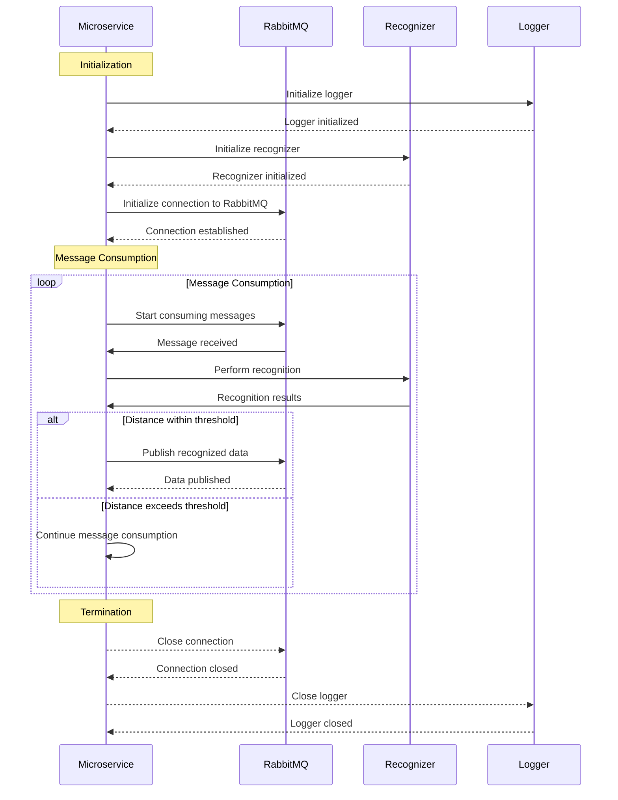
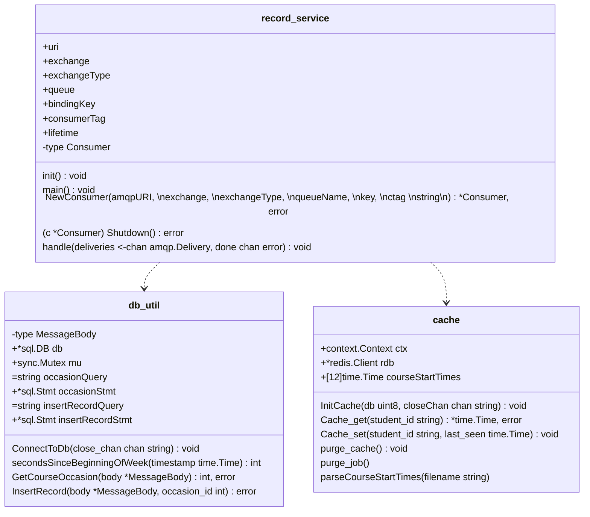
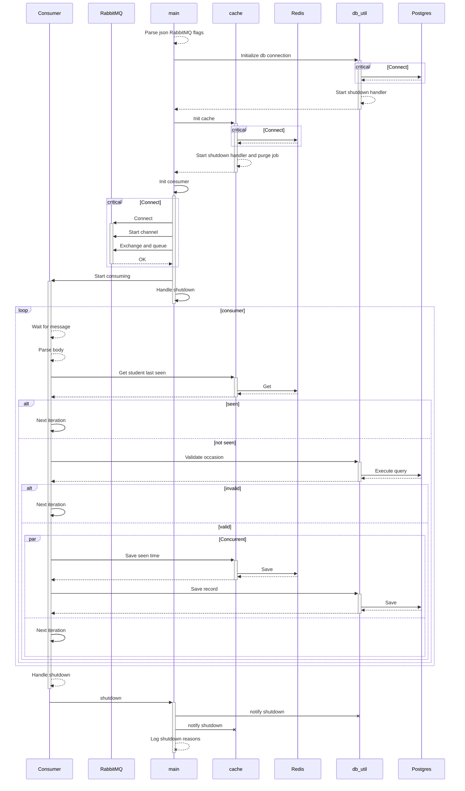

# Architecture diagram

```mermaid
flowchart TD
    a[Face detector]
    b[Recognizer service]
    c[Record service]
    d[Broker]
    e[Database]

    A((Camera))
    B((FaceNET))
    C((KD Tree))

    a <-.-> A
    a <-.-> B
    a ===> d <==> b 
    b <-.-> C
    d ===> c
    c <--> e
```
---
# Class diagram 1

``` mermaid
classDiagram
class publisher{
    :: Exchange
    :: Exchange_type
    :: Routing_key
    :: Queue
    +credentials
    +connection
    +channel
    + send_message(data: dict) void
    + close() void
}

class face_detector{
    :: Device_id
    +list gpus
    +camera
    publish_embedding() void
}

face_detector ..> publisher
```

---
# Sequence diagram 1

``` mermaid
sequenceDiagram
    participant Microservice
    participant Webcam
    participant DeepFace
    participant Publisher
    participant RabbitMQ

    Note over Microservice: Initialization
    Microservice->>DeepFace: GPU Configuration
    DeepFace-->>Microservice: Configuration complete
    Microservice->>Webcam: Initialize video capture
    Webcam-->>Microservice: Video capture initialized
    Microservice->>Publisher: Initialize
    Publisher->>RabbitMQ: Initialize connection to RabbitMQ
    RabbitMQ-->>Publisher: Connection established

    Note over Microservice: Main Event Loop
    loop Main Loop
        Microservice->>Webcam: Capture frame
        Webcam->>Microservice: Captured frame
        alt Face Detected
            Microservice->>DeepFace: Extract embeddings
            DeepFace-->>Microservice: Detected embeddings
            Microservice->>Publisher: Publish embeddings
            Publisher-->>RabbitMQ: Message with embeddings
        else No Face Detected
            Microservice->>Microservice: Continue loop
        end
    end

    Note over Microservice: Termination
    Microservice->>Webcam: Release video capture
    Webcam-->>Microservice: Video capture released
    Microservice->>Publisher: Close connection to RabbitMQ
    Publisher-->>RabbitMQ: Connection closed


```

---
# Class digarm 2

``` mermaid
classDiagram
class Recognizer{
    __init__(\nannoy_tree_file: str, \nvector_size: int, \ndistance_metric: Literal["angular", "euclidean", "manhattan", "hamming", "dot"]\n) void
    recognize(\nvector: str) int
}

class service{
    :: EXCHANGE
    :: EXCHANGE_TYPE
    :: CONSUME_ROUTING_KEY
    :: RESULT_ROUTING_KEY
    :: CONSUME_QUEUE
    :: RESULT_QUEUE
    :: TREE_FILE
    :: METRIC
    :: VECTOR_SIZE
    :: MAX_DIST
    :: LOG_FORMAT
    :: LOGGER
    +Recognizer rec
    +recognize(channel, method_frame, header_frame, body) void
    +connection
    +channel
}

service *-- Recognizer
```

---
# Sequence diagram 2

``` mermaid
sequenceDiagram
    participant Microservice
    participant RabbitMQ
    participant Recognizer
    participant Logger

    Note over Microservice: Initialization
    Microservice->>Logger: Initialize logger
    Logger-->>Microservice: Logger initialized
    Microservice->>Recognizer: Initialize recognizer
    Recognizer-->>Microservice: Recognizer initialized
    Microservice->>RabbitMQ: Initialize connection to RabbitMQ
    RabbitMQ-->>Microservice: Connection established

    Note over Microservice: Message Consumption
    loop Message Consumption
        Microservice->>RabbitMQ: Start consuming messages
        RabbitMQ->>Microservice: Message received
        Microservice->>Recognizer: Perform recognition
        Recognizer->>Microservice: Recognition results
        alt Distance within threshold
            Microservice->>RabbitMQ: Publish recognized data
            RabbitMQ-->>Microservice: Data published
        else Distance exceeds threshold
            Microservice->>Microservice: Continue message consumption
        end
    end

    Note over Microservice: Termination
    Microservice-->>RabbitMQ: Close connection
    RabbitMQ-->>Microservice: Connection closed
    Microservice-->>Logger: Close logger
    Logger-->>Microservice: Logger closed
```

---
# Class diagram 3

```mermaid
classDiagram
class record_service{
    +uri
    +exchange
    +exchangeType
    +queue
    +bindingKey
    +consumerTag
    +lifetime
    -type Consumer

    init() void
    main() void
    NewConsumer(amqpURI, \nexchange, \nexchangeType, \nqueueName, \nkey, \nctag \nstring\n) *Consumer, error
    (c *Consumer) Shutdown() error
    handle(deliveries <-chan amqp.Delivery, done chan error) void
}

class db_util{
    -type MessageBody
    +*sql.DB db
    +sync.Mutex mu
    =string occasionQuery
    +*sql.Stmt occasionStmt
    =string insertRecordQuery
    +*sql.Stmt insertRecordStmt

    ConnectToDb(close_chan chan string) void
    secondsSinceBeginningOfWeek(timestamp time.Time) int
    GetCourseOccasion(body *MessageBody) int, error
    InsertRecord(body *MessageBody, occasion_id int) error
}

class cache{
    +context.Context ctx
    +*redis.Client rdb
    +[12]time.Time courseStartTimes 
    InitCache(db uint8, closeChan chan string) void
    Cache_get(student_id string) *time.Time, error
    Cache_set(student_id string, last_seen time.Time) void
    purge_cache() void
    purge_job()
    parseCourseStartTimes(filename string)
}

record_service ..> db_util
record_service ..> cache
```

---
# Sequence diagram 3

``` mermaid
sequenceDiagram
    participant Consumer
    participant RabbitMQ
    participant main
    participant cache
    participant Redis
    participant db_util
    participant Postgres
    


    main -->> main: Parse json RabbitMQ flags
    main ->>+ db_util: Initialize db connection
    critical Connect
        db_util ->> Postgres: 
        Postgres -->> db_util: 
    end
    db_util -->> db_util: Start shutdown handler
    db_util -->>- main: 
    main ->>+ cache: Init cache
    critical Connect
        cache ->> Redis: 
        Redis -->> cache: 
    end
    cache -->> cache: Start shutdown handler and purge job
    cache -->>- main: 
    main ->>+ main: Init consumer
    critical Connect
        main ->>+ RabbitMQ: Connect
        main ->> RabbitMQ: Start channel
        main ->> RabbitMQ: Exchange and queue
        RabbitMQ -->>- main: OK
    end
    main ->>+ Consumer: Start consuming
    main ->>- main: Handle shutdown
    loop consumer
        Consumer -->> Consumer: Wait for message
        Consumer -->> Consumer: Parse body
        Consumer ->>+ cache: Get student last seen
        cache ->> Redis: Get
        Redis -->> cache: 
        cache -->>- Consumer: 
        alt seen
            Consumer ->> Consumer: Next iteration
        else not seen
            Consumer ->>+ db_util: Validate occasion
            db_util ->> Postgres: Execute query
            Postgres -->> db_util: 
            db_util -->>- Consumer: 
            alt invalid
                Consumer ->> Consumer: Next iteration
            else valid
                par Concurrent
                    Consumer ->>+ cache: Save seen time
                    cache ->> Redis: Save
                    Redis -->> cache: 
                    cache -->>- Consumer: 
                    Consumer ->>+ db_util: Save record
                    db_util ->> Postgres: Save
                    Postgres -->> db_util: 
                    db_util -->>- Consumer: 
                and
                    Consumer ->> Consumer: Next iteration
                end
            end
        end
    end
    Consumer -->>- Consumer: Handle shutdown
    Consumer ->>+ main: shutdown
    main -x db_util: notify shutdown
    main -x cache: notify shutdown
    main --x- main: Log shutdown reasons


```