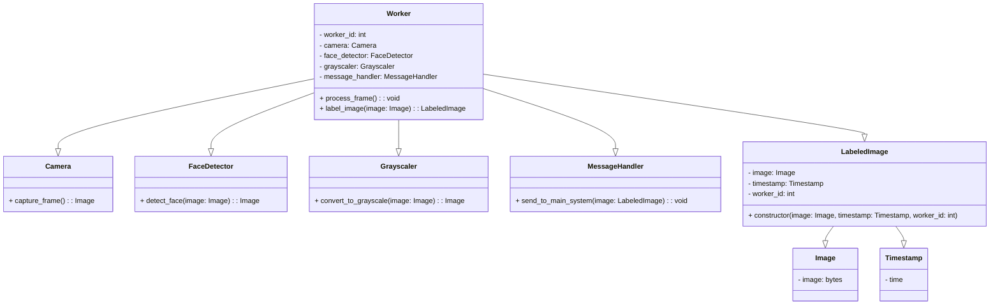

```mermaid
classDiagram
  class Worker {
    - worker_id: int
    - camera: Camera
    - face_detector: FaceDetector
    - grayscaler: Grayscaler
    - message_handler: MessageHandler
    
    + process_frame(): void
    + label_image(image: Image): LabeledImage
  }

  class Camera {
    
    + capture_frame(): Image
  }

  class FaceDetector {
    
    + detect_face(image: Image): Image
  }

  class Grayscaler {
    
    + convert_to_grayscale(image: Image): Image
  }

  class MessageHandler {
    
    + send_to_main_system(image: LabeledImage): void
  }

  class LabeledImage {
    - image: Image
    - timestamp: Timestamp
    - worker_id: int
    
    + constructor(image: Image, timestamp: Timestamp, worker_id: int)
  }

  class Image {
    - image: bytes
  }

  class Timestamp {
    - time
  }

  Worker --|> Camera
  Worker --|> FaceDetector
  Worker --|> Grayscaler
  Worker --|> MessageHandler
  Worker --|> LabeledImage
  LabeledImage --|> Image
  LabeledImage --|> Timestamp

```